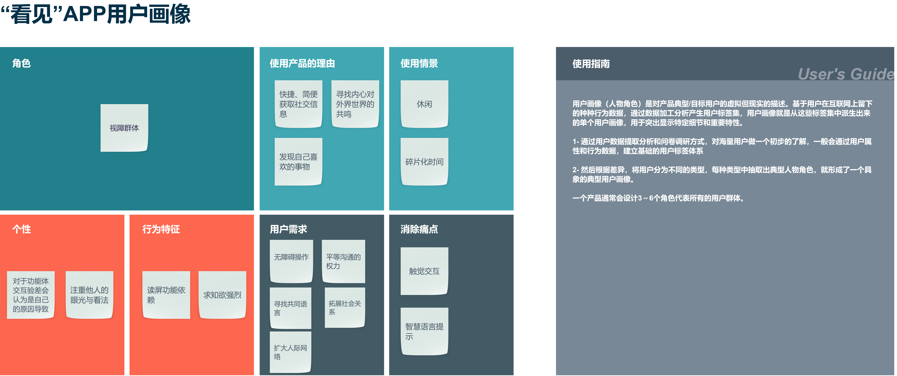
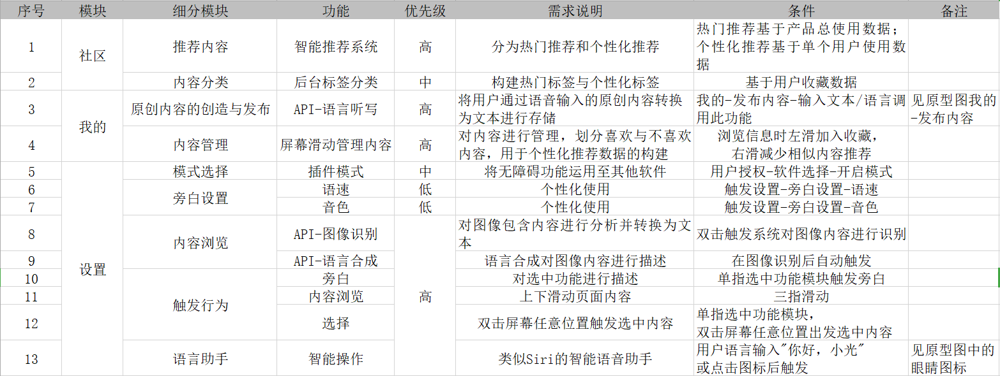

# API_MLfinalproject
API课程期末项目产品文档
</br>
</br>

## 文档简介：
本文档主要描述“看见”小程序的功能需求及其设计，目的在于清晰的定义各个模块的需求细节及逻辑流程，并清晰、有层次的定义页面原型中各个模块的内容来源和相关的逻辑。
</br>
</br>

## 文档使用范围：
此文档主要描述“看见”APP项目中前端页面涉及到的功能点、相对应的后台管理功能支持、以及部分交互细节。本文档主要读者为研发人员、测试人员、市场运营人员、产品经理以及管理人员以及视觉设计师等。
</br>
</br>

## 产品说明
|产品名称|看见|
| --- | --- |
|文件状态|正在修改|
|当前版本|s1.0|
|作者|麦锋源|
|最后修订日期|2021-01-15|
</br>

## 文档版本信息
|序号|版本号|修订人|修订日期|备注|
| --- | --- | --- | --- | --- |
|1|s1.0|麦锋源|2020-12-19|创建文档，初步确定产品定位与核心价值|
|2|s1.1|麦锋源|2020-12-21|添加价值主张画布和产品结构流程图|
|3|s1.2|麦锋源|2020-12-22|添加产品功能和信息结构图以及总体流程图|
|4|s1.3|麦锋源|2020-12-23|添加功能列表|
|5|s1.4|麦锋源|2020-12-29|添加数据流程图，完善产品特色|
|6|s1.5|麦锋源|2021-1-3|对API应用平台进行实践分析，构建对比数据|
|7|s1.6|麦锋源|2021-1-5|添加用户浏览社区内容用例图|
|8|s1.7|麦锋源|2021-1-10|将价值主张画布更改为用户画像，添加API代码示例：通用物体与场景识别|
|9|s1.8|麦锋源|2021-1-11|完善图像识别技术api的代码示例对比|
|10|s1.9|麦锋源|2021-1-16|添加智能API加值说明|
|11|s2.0|麦锋源|2021-1-20|添加原型图链接与相关说明|
</br>

## 目录
|产品介绍|数据架构|产品功能|可行性分析|需求分析
| --- | --- | --- | --- | --- |
|[产品概述](#chapter1) |[功能结构](#chapter5)|[功能列表](#chapter8)|[商业模式](#chapter11)|[需求调研](#chapter14)|
|[产品定位](#chapter2) |[信息结构](#chapter6)|[原型界面](#chapter9)|[利害分析](#chapter12)|[用户评估](#chapter15)|
|[产品特色](#chapter3) |[总体流程](#chapter7)|[数据流与界面](#chapter10)|[风险对策](#chapter13)|[竞品分析](#chapter16)|
|[价值主张](#chapter4) |---------|[用例图](#chapter_case)|[API加值分析](#chapter_key)|[其他](#chapter17)|
</br>
</br>

## 产品介绍

<h3 id="chapter1">一、产品概述</h3>
本产品将致力于服务视力障碍人群，通过图像识别和智能语音技术，对被拍摄的事物进行识别后输出语音描述，并对用户进行解释说明，最大化满足视力障碍人士对新事物的认知、分享以及平等拓展社会人际关系的需求，为用户提供无障碍体验，创造有价值的沟通社区，为视障人士打开更丰富、多彩的世界。

#### MVP加值说明（融合人工智能API）
|问题情境|解决方案|
| --- | --- |
|无法看见眼前的事物，并对其做出行为判断|API——物体识别与场景识别+语音合成：对被拍摄事物进行分析，通过语言的方式实时输出给用户|
|无法正常通过图片或视频读取社交信息|API-图像识别+语言合成：对离线图像进行分析，并通过语言输出给用户|
|分享个人日志|API——语言转写+NLP：将用户输入的语言转换成文本存入发布信息中|
|简化使用操作|API——人脸识别+语音识别：辅助用户高校、安全使APP|

</br>
</br>

<h3 id="chapter2">二、产品定位</h3>
针对视障群体打造的一款结合摄影、创作和分享的APP“看见”，运用图形识别技术，解读像素背后所蕴含的真谛，创造出社会人文价值。
</br>
</br>

<h3 id="chapter3">三、产品特色</h3>
产品以智能、无障碍为主要价值导向，将图像识别、NLP技术的与机器学习-决策服务相融合，为视障人群带来最舒适、最贴心的使用体验。此外，产品将贯彻“Less is more”的设计理念，将极简的风格渲染至产品的每一处细节，打破传统影音软件多元素泛滥的外表，使得产品始终聚焦在核心功能的设计上，优化用户在无障碍与流畅性等方面的使用体验。
</br>
</br>

<h3 id="chapter4">四、价值主张</h3>



“手机产商们总是竭力地优化着99%的体验，但总有人愿意去解决着1%的问题。无障碍模式往往被藏在设置界面里的角落，但它却是最具有人文关怀的功能”，这一定程度上代表APP“看见”的这一类产品。那些边缘的需求或许不及大众产品的所创造的商业价值，相对没有庞大的受众与支持，但这些往往是被我们所忽视人类社会最具温暖的东西。科技发展目的是为了人类更好的生活，既然如此，给予特殊群体更多的帮助和温暖也应贯彻每个交互产品的核心价值。基于这个理念，“看见”将价值主张聚焦于视障人群，希望能突破正常生活温暖的包裹，去拥抱那些仍在寒风中行走的人。


</br>

## 数据架构
<h3 id="chapter5">五、功能结构</h3>

<div align=center></div>

</br>

<h3 id="chapter6">六、信息结构</h3>

<div align=center></div>


</br>

<h3 id="chapter7">七、总体流程</h3>

<div align=center></div>

</br>

## 产品功能


<h3 id="chapter8">八、功能列表</h3>



<br/>

<h3 id="chapter9">九、原型图</h3>

[产品原型图在线浏览](https://modao.cc/app/f83ebdfdc74e882f158a6cfadd000e95d9ba5d4a/embed/v2)

<br/>

<h3 id="chapter10">十、数据流与界面</h3>

<div align=center></div>

<br/>

<h3 id="chapter_case">十一、用例图</h3>

#### 使用情境说明
“看见APP”的使用情境涵盖视障群体的日常生活，包括社交、出行、导航、记录生活等。下方用例图主要以两个使用情境做具体说明：
<br/>
1. 用户从注册成为应用的浏览者到内容的创作者的过程；
2. 用户通过APP寻求帮助，达到方便规划出行的目的。

<div align=center></div>

<br/>

<h3 id="chapter_key">API加值分析</h3>

产品结合图像识别、语言合成等智能API，进一步简化用户在使用产品时所需要操作步骤，通过简单的指控，智能语音系统与对用户的脸部识别完成登入、浏览、分析等功能，最大程度满足无障碍使用体验。

#### 通用物体识别与场景识别技术
- 以百度和讯飞两个平台图像识别API服务技术实践得出的比对结果

|对比项|百度|讯飞|
|---|---|---|
|代码示例-图像识别技术：场景与物体识别|[百度api代码示例](https://github.com/Maifengyuan/API_MLfinalproject/blob/main/code/%E7%99%BE%E5%BA%A6-%E9%80%9A%E7%94%A8%E7%89%A9%E4%BD%93%E5%92%8C%E5%9C%BA%E6%99%AF%E8%AF%86%E5%88%AB.ipynb)|[讯飞api代码示例](https://github.com/Maifengyuan/API_MLfinalproject/blob/main/code/%E8%AE%AF%E9%A3%9E-%E5%9C%BA%E6%99%AF-%E7%89%A9%E4%BD%93-%E5%9C%BA%E6%89%80%E8%AF%86%E5%88%AB.ipynb)|

<h4>场景识别实践结果</h4>

<div align=center></div>

1. 百度场景识别API返回参数

```
{'log_id': 5712521386408023851,
 'result_num': 5,
 'result': [{'score': 0.358338, 'root': '建筑-其他', 'keyword': '居民楼'},
  {'score': 0.253114, 'root': '自然风景-天空', 'keyword': '天空'},
  {'score': 0.17113, 'root': '建筑-现代建筑', 'keyword': '剧院/博物馆/礼堂'},
  {'score': 0.088515, 'root': '自然风景-其他', 'keyword': '风景'},
  {'score': 0.006694, 'root': '植物-树', 'keyword': '树'}]}
```

2. 讯飞场景识别API返回参数

```
{'code': 0,
 'data': {'fileList': [{'label': 9,
    'labels': [9, 3, 11, 18, 10],
    'name': 'test01.jpg',
    'rate': 0.9986672401428223,
    'rates': [0.9986672401428223,
     0.0010075508616864681,
     0.0002714783186092973,
     3.254865441704169e-05,
     1.3011311239097267e-05],
    'review': False}],
  'reviewCount': 0,
  'topNStatistic': [{'count': 1, 'label': 9}]},
 'desc': 'success',
 'sid': 'tup000011d5@dxb9d81358500b000100'}
```

|参数|返回值|说明|
| --- | --- | --- |
|label|9| 对应场景：山峰|
|labels|9,3,11,18,10|表示前5个最可能场景的label，分别是山峰，草地，森林，其他场景，湖|
|rate|0.99|介于0-1间的浮点数，表示该图像被识别为某个分类的概率值，概率越高、机器越肯定|
|rates|0.99,0.001,0.0002,3.25,1.3|labels对应，前5个最可能场景对应得分|
|review|False|返回true时存在偏差，可信度较低，返回false时可信度较高|

```
{"place":[{
    "entity":[{
        "id":32,"name":"street",
        "score":0.83509528636932373
        }],
     "frameID":0,"startTimeOffset":0.0}]
 }
```

|参数|返回值|说明|
| --- | --- | --- |
|id/name|32,street|识别结果：街道|
|score|0.83|置信度|

<hr/>

<h4>物体识别实践结果</h4>

<div align=center></div>

1. 百度物体识别API返回参数

```
{'log_id': 6639343850218473740,
 'result_num': 5,
 'result': [{'score': 0.31101, 'root': '商品-电脑办公', 'keyword': '笔记本电脑'},
  {'score': 0.230072, 'root': '商品-数码产品', 'keyword': '台式电脑'},
  {'score': 0.155608, 'root': '商品-家用电器', 'keyword': '音箱'},
  {'score': 0.076702, 'root': '商品-电脑办公', 'keyword': '键盘'},
  {'score': 0.001803, 'root': '商品-电脑办公', 'keyword': '电脑'}]}
```

2. 讯飞物体识别API返回参数

```
{'code': 0,
 'data': {'fileList': [{'label': 19903,
    'labels': [19903, 18881, 1314, 4760, 3042],
    'name': 'stest02.jpg',
    'rate': 0.26318418979644775,
    'rates': [0.26318418979644775,
     0.043663863092660904,
     0.03755110874772072,
     0.027026833966374397,
     0.023022780194878578],
    'review': True}],
  'reviewCount': 1,
  'topNStatistic': [{'count': 1, 'label': 19903}]},
 'desc': 'success',
 'sid': 'tup000011dc@dx680d13585d5b1aba00'}
```

|参数|返回值|说明|
| --- | --- | --- |
|label|19903| 对应物体：老鼠；分类：物品|
|labels|19903, 18881, 1314, 4760, 3042|表示前5个最可能场景的label，分别是老鼠，笔记本，无线局域网络，外围设备，计算机鼠标|
|rate|0.26|介于0-1间的浮点数，表示该图像被识别为某个分类的概率值，概率越高、机器越肯定|
|rates|0.26,0.043,0.037,0.027,0.023|labels对应，前5个最可能场景对应得分|
|review|True|返回true时存在偏差，可信度较低，返回false时可信度较高|

<br/>

|实践结果分析|百度|讯飞|
|---|---|---|
|效果对比：场景识别|对于场景识别所使用的图像，我们能直观的看到两排偏橙色的教学楼、中间的绿树、人行道与远处的山和泛黄的天空，这是对于视觉正常的人所能达到的直观感受，在百度API返回的结果中，场景中除了街道，存在的四个主要部分都能基本正确的识别出来，这一点要优于讯飞API。但在具体描述（keyword）准确率不高，但这一点相比讯飞有了更具象的说明|讯飞API对于识别需要结合场景识别与场所识别返回的结果，并没有识别出建筑，但相比百度API识别到了街道|
|效果对比：物体识别|物体识别选用了一张主体明显的图片，包括笔记本电脑、蓝牙耳机和鼠标。百度API一次返回五个识别结果，匹配的对象包括两个（笔记本电脑、键盘），耳机错误识别成音响，其次没有识别出鼠标，结果的准确率与实际图片存在差距|讯飞API返回的结果包括鼠标，笔记本，无线局域网络，外围设备，计算机鼠标，其中结果和百度都存在一个特点，因为主题少于结果参数个数值，会出现重复的结果参数，此外相比于百度并没有识别出耳机|
|性价比衡量|免费调用量日均主要是500次，开通按量后付费调用失败不计费[百度ai开放平台图像识别产品价格](https://ai.baidu.com/ai-doc/IMAGERECOGNITION/rk3bcxa9e)|免费调用量日均主要是500次，附加90天10万次的体验包，若是付费的话分为三个套餐，1万服务量350元/年；10万服务量3200/年；100万服务量30000元/年[讯飞开放平台图像识别产品价格](https://www.xfyun.cn/services/site_identification?target=price)|
|服务评估|仅有api文档且无示例代码，应用场景和参数不完整，无法进行进一步开发调用|[具有详细的说明](https://www.xfyun.cn/services/wordRecg)及[api调用教程](https://www.xfyun.cn/doc/words/wordRecg/API.html#%E6%8E%A5%E5%8F%A3%E8%AF%B4%E6%98%8E),且参数划分完整，提供业务参数，可扩展性强|

- 总结：利用场景/物体识别API的最终目的是将正常视觉所能传达的信息以语音描述的方式完美呈现给视障人群，所以对API最基础的衡量首先需要看图片内容识别的匹配程度，结合场景与物体识别，以基础的API调用测试，两个平台的的准确率相差甚少，但百度API做了更加细分的处理，在对主题目标进行识别后，还进行了细分标签的判断，例如将建筑具体到剧院/博物馆/礼堂。这一点上百度API占优势。物体识别两个平台的准确率较为相似，但实践中只对百度对通用物体和场景的API功能进行调用，此外百度提供的识别还包括很多细分类别，这一点上百度显然投入更多，相比较与讯飞更有优势。

<div align=center></div>

<br/>

#### 文字转语音技术
- 以百度和讯飞两个平台文字转语音API服务技术实践得出的比对结果

|对比项|百度|讯飞|
|---|---|---|
|代码示例|[百度-语音合成](https://github.com/Maifengyuan/API_MLfinalproject/blob/main/code/%E7%99%BE%E5%BA%A6-%E8%AF%AD%E9%9F%B3%E5%90%88%E6%88%90.ipynb)|[讯飞-语音合成](https://github.com/zhengxiaopingzxp/API_ML_PM_Final_Project/blob/master/code/%E8%AE%AF%E9%A3%9E%E6%89%8B%E5%86%99%E5%AD%97api.ipynb)|

<h4>语言合成实践结果</h4>

> 分析文本 Text = "又是平静的一天，我只想过普通人的生活"

1. 百度语音合成API返回参数

[百度-语音合成返回结果音频存放地址](https://github.com/Maifengyuan/API_MLfinalproject/blob/main/code/%E5%90%89%E8%89%AF%E5%90%89%E5%BD%B1.mp3)

2. 讯飞语音合成API返回参数

[讯飞-语音合成返回结果音频存放地址](https://github.com/Maifengyuan/API_MLfinalproject/blob/main/code/%E5%90%89%E8%89%AF%E5%90%89%E5%BD%B1.mp3)

<br/>

|实践结果分析|百度|讯飞|
|---|---|---|
|效果对比|对于字迹潦草的字体根本无法输出文字，仅使用与字体工整的手写字|对于字迹潦草的字体，仍然能给出部分输出文字，相比百度而已文字的识别准确度也比较高，可查看代码对比|
|性价比衡量|每日 50000 次免费调用量，开通按量后付费。调用失败不计费[百度ai开放平台手写字api产品价格](https://ai.baidu.com/ai-doc/OCR/9k3h7xuv6)|免费次数为90天10万服务量，若是付费的话分为三个套餐，1万服务量350元/年；10万服务量3200/年；100万服务量30000元/年[讯飞开放平台手写字api](https://www.xfyun.cn/services/wordRecg)|
|服务评估|仅有api文档且无示例代码，应用场景和参数不完整，无法进行进一步开发调用|[具有详细的说明](https://www.xfyun.cn/services/wordRecg)及[api调用教程](https://www.xfyun.cn/doc/words/wordRecg/API.html#%E6%8E%A5%E5%8F%A3%E8%AF%B4%E6%98%8E),且参数划分完整，提供业务参数，可扩展性强|

- 总结：

</br>

## 可行性分析

<h3 id="chapter11">十二、商业模式</h3>

</br>
<h3 id="chapter12">十三、利害分析</h3>

</br>
<h3 id="chapter13">十四、风险对策</h3>

</br>

## 需求分析

<h3 id="chapter14">十五、需求调研</h3>

</br>
<h3 id="chapter15">十六、用户评估</h3>

</br>
<h3 id="chapter16">十七、竞品分析</h3>
</br>
<h3 id="chapter17">其他</h3>
</br>

#### 关于作者的一些话和展望
这次的文档我参考了很多专业的产品文档与过去学长/学姐的案例，相比他们我在文档中增加了很多文字阐述，我认为自己的优势是绘制流程图，这一方面我有提前做过很多功课，所以上手和流程思维会稍快一些。这使得文档整体的呈现风格偏故事化，这在一定程度上有违于规范的产品文档，偏向个性化。但作为课程实践，我认为这样有利于运用自己的所学所想去表达产品思维，我更希望将这作为一个作品展示。<br/>
不过纵观自己的产品文档，也有不少缺陷：

- 工具运用：
1. [会议桌](https://app.huiyizhuo.com/login?redirect=https%3A%2F%2Fapp.huiyizhuo.com%2F)
2. [Process On](https://www.processon.com/)
3. [墨刀](https://modao.cc/dashboard)

#### 参考材料
|来源|作者|标题|链接|
| --- | --- | --- | --- |
|环球网|秦璐敏|《中国视障群体约1731万人 30岁以下年轻人占23.5%》|[](https://china.huanqiu.com/article/9CaKrnKl9mV)|
|2016年中国互联网视障用户基本情况报告|中国信息无障碍产品联盟|《中国互联网视障用户基本情况报告》|[](http://www.199it.com/archives/460010.html)|
|时代数据|郑艺阳|《中国有1730万盲人，为什么我们很少看到他们！》|[](https://baijiahao.baidu.com/s?id=1647725605829566019&wfr=spider&for=pc)|
|2019腾讯发布|腾讯X信息无障碍研究会|《视障人士在线社交报告》|[报告链接](http://www.siaa.org.cn/media/1/%E8%A7%86%E9%9A%9C%E4%BA%BA%E5%A3%AB%E5%9C%A8%E7%BA%BF%E7%A4%BE%E4%BA%A4%E6%8A%A5%E5%91%8A_%E5%9B%BE%E6%96%87%E7%89%88_.pdf)|
|中国信息无障碍产品联盟秘书处|中国信息无障碍产品联盟|《中国互联网视障用户基本情况报告》|[报告链接](http://www.siaa.org.cn/media/1/%E4%B8%AD%E5%9B%BD%E4%BA%92%E8%81%94%E7%BD%91%E8%A7%86%E9%9A%9C%E7%94%A8%E6%88%B7%E5%9F%BA%E6%9C%AC%E6%83%85%E5%86%B5%E6%8A%A5%E5%91%8A.pdf)|
|图书馆论坛|丁亚茹，肖鹏|《国外视障人群信息行为研究综述》|[论文链接](http://qikan.cqvip.com/Qikan/Article/Detail?id=7002561077)|
|Bilibili视频|up：六分超超|《这才是iPhone的最强功能，不接受反驳——视觉无障碍功能体验》|[视频链接](https://www.bilibili.com/video/av202959101)|
