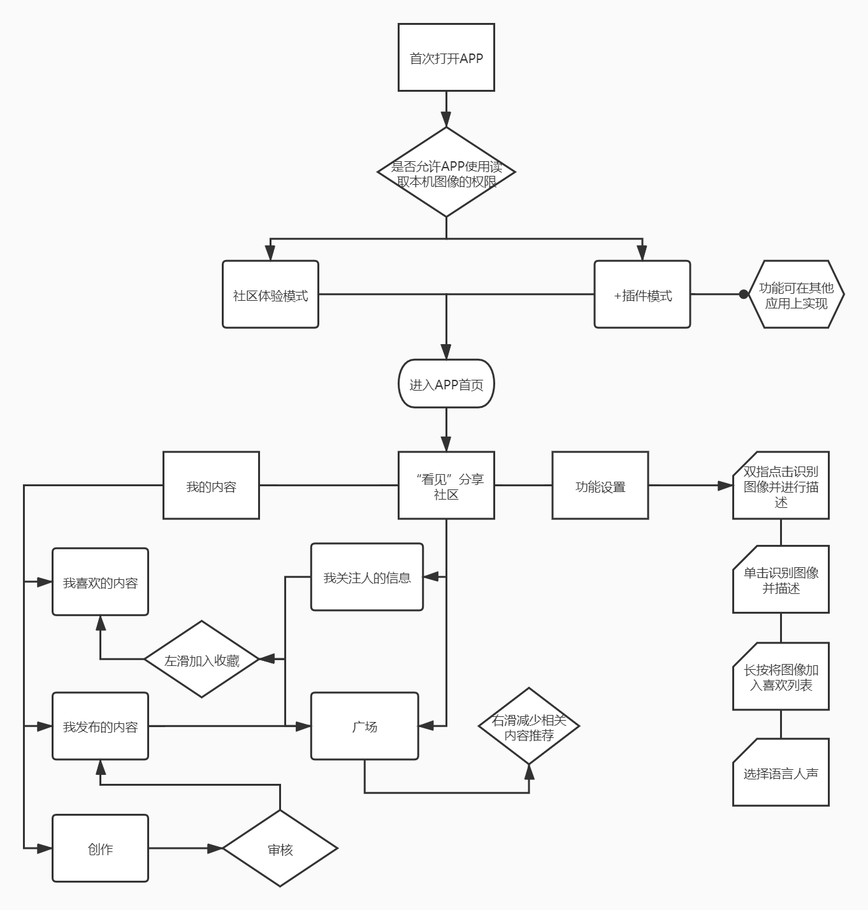

# API_MLfinalproject
API课程期末项目产品文档
 
 

## 文档简介：
本文档主要描述“看见”小程序的功能需求及其设计，目的在于清晰的定义各个模块的需求细节及逻辑流程。目的主要是清晰、有层次的定义页面原型中各个模块的内容来源和相关的逻辑。
 
 

## 文档使用范围：
此文档主要描述“看见”APP项目中前端页面涉及到的功能点、相对应的后台管理功能支持、以及部分交互细节。本文档主要读者为研发人员、测试人员、市场运营人员、产品经理以及管理人员以及视觉设计师等。
 
 

## 产品说明
|产品名称|看见|
| --- | --- |
|文件状态|正在修改|
|当前版本|s1.0|
|作者|麦锋源|
|最后修订日期|2020-12-20|
 

## 版本信息
|序号|版本号|修订人|修订日期|备注|
| --- | --- | --- | --- | --- |
|1|s1.0|麦锋源|2020-12-19|创建文档，初步确定产品定位与核心价值|
|2|s1.1|麦锋源|2020-12-21|添加价值主张画布和产品结构流程图|
 

## 目录
|产品介绍|产品架构|产品功能和需求|项目规划|
| --- | --- | --- | --- |
|[产品概述](#chapter1) |[产品结构](#chapter5)|[功能列表](#chapter8)|[时间与版本规划](#chapter12)|
|[产品定位](#chapter2) |[信息结构](#chapter6)|[原型界面](#chapter9)|[成本预算](#chapter13)|
|[产品特色](#chapter3) |[总体流程](#chapter7)|[数据流与界面](#chapter10)|[风险对策](#chapter14)|
|[价值主张](#chapter4) |---------|[用例图](#chapter11)|[需求调研](#chapter15)|
 
 

<h3 id="chapter1">一、产品概述</h3>
本产品还将致力于服务视力障碍人群，通过图像识别和文字识别技术，对被拍摄的事物进行识别，并对用户进行解释或科普，最大化满足视力障碍人士对新事物的认知、学习、分享产生的需求，为用户提供快捷的查询体验，创造有价值的分享社区，为视障人士打开更有趣、多彩的世界。

<h3 id="chapter2">二、产品定位</h3>
针对视障群体打造的一款结合摄影、创作和分享的APP“看见”，运用智能图形识别技术，解读像素背后所蕴含的真谛，通过分享社区创造出“你是我的眼，世界就在我眼前”的用户体验。

<h3 id="chapter3">三、产品特色</h3>
APP融合图像识别、NLP技术的设计与机器学习的决策服务，将结合CCC页面的优良设置，打破传统的DDD设计理念，使得产品，优化用户在EEE、FFF等方面的用户体验

<h3 id="chapter4">四、价值主张</h3>

<h3 id="chapter5">五、产品结构</h3>

**总体流程**

